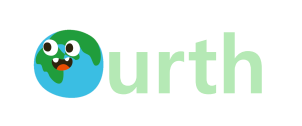
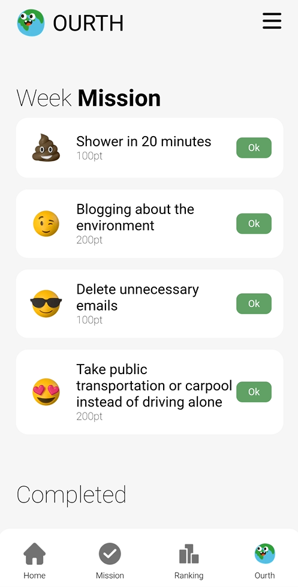
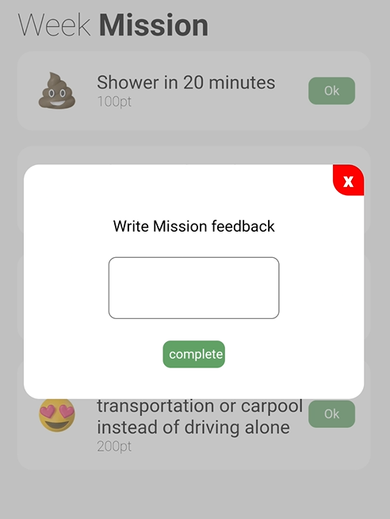
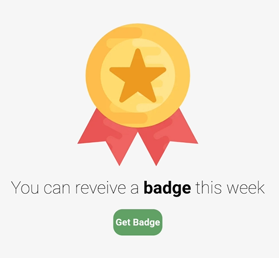
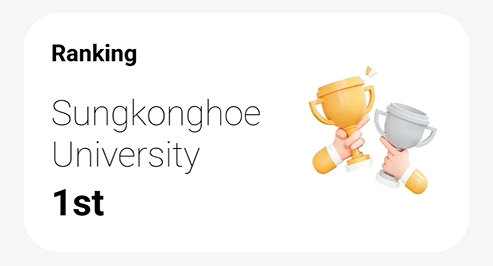
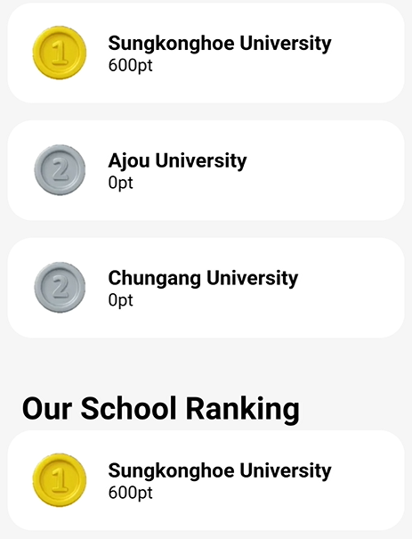
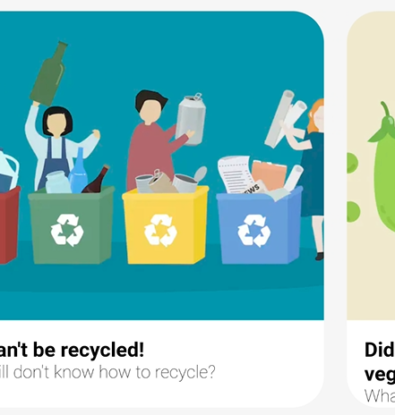
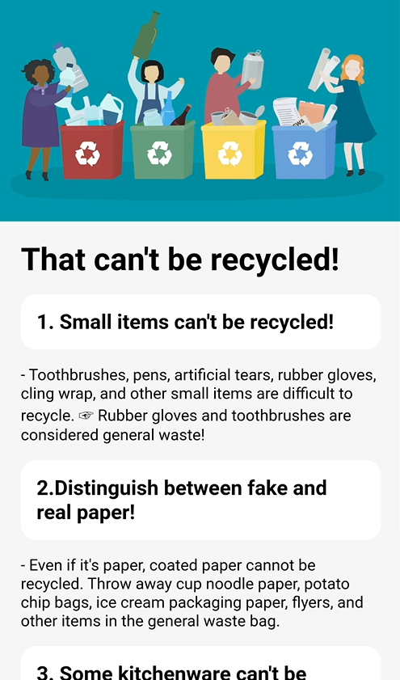
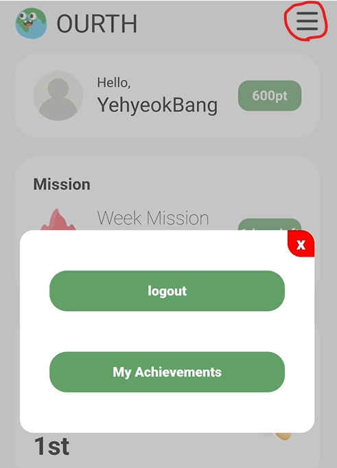
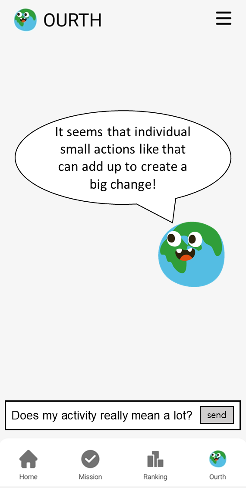

# Ourth-Backend
GDSC Solution Challenge 2023

# Because It's Ours

## Ourth-Info
<B>"Ourth"</B> means <B>"Our + Earth."</B>    
Providing daily-friendly solutions and content for individuals to protect the Ourth.

## Ourth-Goal
 
We set the goal of 13. CLIMATE ACTION and targeted students around the world.   
The goal of our project is to promote the fact that even individuals can be sufficient to take care of "our earth" and to encourage a sense of collective responsibility to protect it as something that belongs to all of us.

## Ourth-Feature

Missions

- We provide missions that individuals can easily contribute to the environment of the Ourth.
- There are various missions, and four of them are randomly given each week.
- You can receive a badge by completing all the missions for the week, and the completed missions and badges can be viewed in the "Achievement" section.

1. Week Mission  
 
2. Complete  
 
3. All Complete & Badge  
 

Ranking

- Students can participate in friendly competition with other schools based on the total contribution points, and they can feel a sense of belonging.
- Currently, only universities in Korea affiliated with GDSC can participate.  

1. Our School Ranking  
 
2. All Ranking & Our School Ranking  
 

Tips

- The 'Tips' section collects information on environmental tips, news, and campaigns.

1. Tips  
 
2. Details  
 

Achievement

- The 'Achievement' section, you can see your actions of protecting the Ourth.
- You can see the missions you have completed so far and the number of badges you have earned.

1. Click Menu  
 
2. Achievement  
 

Ourth-chat (Preparing)

- We are brainstorming content to have conversations with the Earth that feel alive.
- The Earth will be aware of our completed missions, badges earned, and news we have read. Our goal is to form a connection between the user and the Earth, and to inspire a desire to protect the Ourth.
- We are exploring the use of Google's Bard or OpenAI's chatgpt

1. Example  
 

## Backend-API
Providing RESTful APIs to the frontend for CRUD operations, authentication, and authorization. We used Spring Boot and Java to build the backend APIs.

## Backend-DB
This component is responsible for storing and retrieving application data. We used MySQL as our database.

DB ERD

1. DB ERD  
 

## Authentication-Firebase
- This component is responsible for user authentication and authorization. We used Firebase Admin SDK to link email/password authentication with our backend APIs.
- Anyone can sign up with any email address, but they need to click on the authentication link sent to that email in order to log in properly.

Example

1. SignUp  
    
2. Email Verifylink click  
    
3. SignIn  
    

## Google Cloud Platform
The backend server was deployed using Google Cloud Platform.

## Frontend & Flutter-app
- [Frontend-Repo](https://github.com/sinamong0620/Ourth-Frontend)
- [Flutter-app-Repo](https://github.com/rltgjqmtkdydwk/Ourth-Flutter-app)

## Ourth-Project Next Step
1. We hope to use technologies such as Google's Bard or OpenAI's ChatGPT to make the planet we want to protect appear as if it is truly alive.
2. We hope to provide solutions tailored to each country's situation and have a positive impact on everyone.

## Tech Stack  
- JDK-17
- Spring Boot-3.0.2
- Google Cloud Platform
- Firebase
- Redis
- MySQL

## Youtube Link
[Ourth-GDSC Solution Challenge 2023](https://youtu.be/7p_yKxrUqN0)

## Ourth-Team
| [Yehyeok Bang](https://github.com/yehyeokBang) |[Seongeun Kwak](https://github.com/HYEALL)|  [Shinah Kim](https://github.com/sinamong0620)  | [Eunchong Kim](https://github.com/rltgjqmtkdydwk) |
|:----------------------------------------------:|:---:|:-----------------------------------------------:|:-------------------------------------------------:|
|    ||  |  |
|                    Backend                     |Backend|                    Frontend                     |                      Mobile                       |
