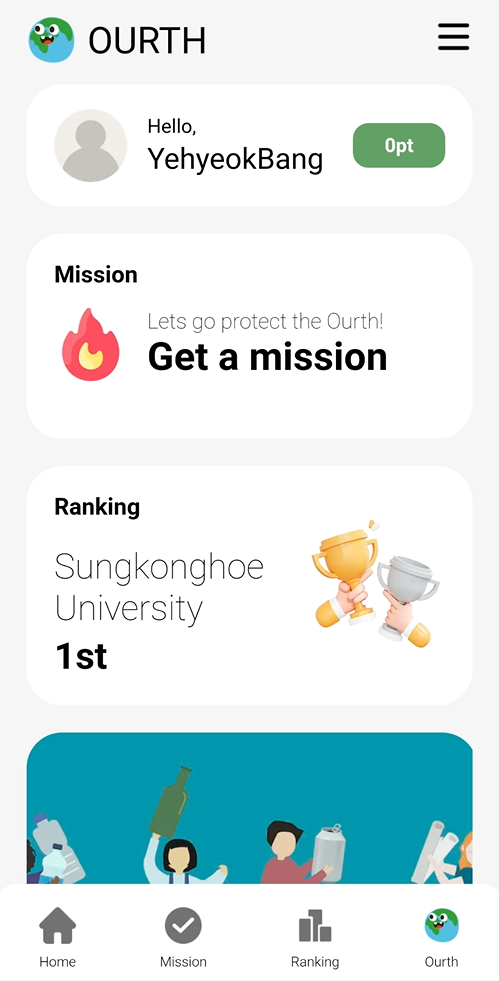

# Ourth-Backend
GDSC Solution Challenge 2023

## Ourth-Info
<B>"Ourth"</B> means <B>"Our + Earth."</B>    
Providing daily-friendly solutions and content for individuals to protect the Ourth.

## Ourth-Goal
The goal of our project is to promote the fact that even individuals can be sufficient to take care of "our earth" and to encourage a sense of collective responsibility to protect it as something that belongs to all of us.

## Backend-API
Providing RESTful APIs to the frontend for CRUD operations, authentication, and authorization. We used Spring Boot and Java to build the backend APIs.

## Backend-DB
This component is responsible for storing and retrieving application data. We used MySQL as our database.

## DB ERD

## Authentication-Firebase
- This component is responsible for user authentication and authorization. We used Firebase Admin SDK to link email/password authentication with our backend APIs.
- Anyone can sign up with any email address, but they need to click on the authentication link sent to that email in order to log in properly.

1. SignUp  
  
2. Email Verifylink click
  
3. SignIn  

## Google Cloud Platform
The backend server was deployed using Google Cloud Platform.

## Frontend & Flutter-app
- [Frontend-Repo](https://github.com/sinamong0620/Ourth-Frontend)
- [Flutter-app-Repo](https://github.com/rltgjqmtkdydwk/Ourth-Flutter-app)

## Ourth-Project Next Step
1. We hope to use technologies such as Google's Bard or OpenAI's ChatGPT to make the planet we want to protect appear as if it is truly alive.
2. We hope to provide solutions tailored to each country's situation and have a positive impact on everyone.

## Tech Stack  
- JDK-17
- Spring Boot-3.0.2
- Google Cloud Platform
- Firebase
- Redis
- MySQL